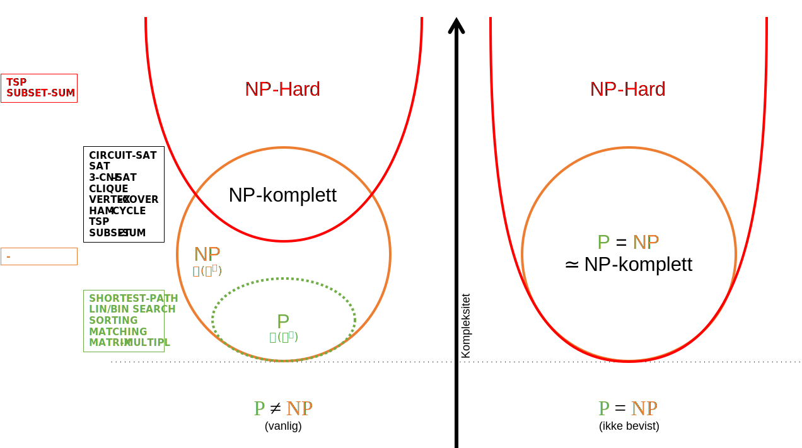
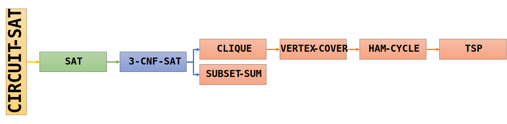

# TDT4120 Algoritmer og datastrukturer

- [Algoritmer](Algoritmer/)
- [Eksterne ressurser](Ressurser/)

<details>
<summary>Overordnede læringsmål i faget</summary>

- Ha kunnskap om
  - et bredt spekter av etablerte algoritmer og datastruktuer
  - klassiske algoritmiske problemer med kjente effektive løsninger
  - komplekse algoritmer uten kjente effektive løsninger
- Ha ferdigheter for å
  - analysere algoritmers korrekthet og kjøretid
  - formulere problemer som kan løses av algoritmer
  - konstruere nye effektive algoritmer
- Være i stand til å
  - bruke eksisterende algoritmer og programvare på nye problemer
  - utvikle nye løsninger på praktiske algoritmiske problemstillinger
- Ved hver algoritme skal man
  - kjenne til den formelle definisjonen av det generelle problemet algoritmen løser
  - kjenne til eventuelle tilleggskrav den stiller for å være korrekt
  - vite hvordan den oppfører seg, kunne utføre den, trinn for trinn
  - forstå korrekthetsbeviset; hvordan og hvorfor virker det egentlig?
  - kjenne til eventuelle styrker og svakheter sammenlignet med andre
  - kjenne til kjøretiden under ulike omstendigheter, og forstå utregningen
- Ved hver datastruktur skal man
  - Forstå algoritmene for de ulike operasjonene på strukturen
  - Forstå hvordan strukturen representeres i minnet
- Ved hvert problem skal man kunne
  - angi presist hva input er
  - angi presist hva output er og hvilke egenskaper det må ha

</details>

<!-- [A1] Forstå bokas pseudokode-konvensjoner (den starter på index 1) -->

## Problemer og algoritmer

- Brute force er ofte helt ubrukelig
- Dekomponer til mindre instanser og bruk de til å finne en løsning

En **algoritme** er en tydelig definert fremgangsmåte som kan ta en verdi eller en mengde verdier som **input** og produserer en verdi eller en mengde verdier som **output**. Algoritmen er ofte en sekvens av beregninger, presist beskrevet. Input verdiene kan deles opp flere **instanser**.

Å **analysere en algoritme** har fått betydningen å "forutse ressurskravene til algoritmen": minne, kommunikasjonsbåndbredde, hardware, beregningstid, og ofte totalkostnaden av disse, i tillegg til å vise **korrekthet**. <!--Link til begrepet korrekthet-->

### Random-access machine modellen (RAM)
<!-- [A2] Kjenne egenskapene til random-access machine-modellen (RAM) -->
I dette faget bruker vi en abstrakt maskin som har følgende egenskaper:

- Aritmetikk: $+$ $-$ $*$ $/$ $\bmod$, $\lfloor x \rfloor$, $\lceil x \rceil$  (enkle instruksjoner)
- Flytting av data og programkontroll
- Instruksjoner kjøres sekvensielt og ikke parallelt
- Håndterer heltall og flyttall

Alle disse operasjonene tar **konstant** tid. Maskinen modellerer **ikke** minnehierarki og caches, og den kan dermed ikke modellere parallell utførelse.

### Kjøretid
<!-- [A3] Kunne definere problem, instans og problemstørrelse -->
Et mål på hvor effektiv algoritmen er det viktigste når man skal analysere alle algoritmer. Vi trenger å beregne kjøretider fordi vi har en begrensning på hvor raske og hvor mye lagringsplass en datamaskin har tilgjengelig. Kjøretiden er det *asymptotiske forholdet mellom størrelsen på problemet og hvor lang tid det vil ta å løse det*.

- Problem: Relasjon mellom input og output
- Instans: En bestemt input
- Problemstørrelse, $n$: Lagringsplass som trengs for en instans
- Kjøretid: En funksjon av problemstørrelsen; større problemer krever mer tid (men hvor mye?)
- Eksempel: Hvis vi teller operasjoner, og hver operasjon tar ett mikrosekund, hvor mye rekker vi på ett år?

Vi er interessert i hvor fort kjøretiden **vokser**. Vi er interessert i en grov størrelsesorden.

#### Noen vanlige kjøretider rangert i synkende rekkefølge

Kompleksitet | Navn | Type
:-----------:|:----:|:-----:
 $\Theta(n!)$ | Factorial | Generell
 $\Omega(k^n)$ | Eksponensiell | Generell
 $O(n^k)$ | Polynomisk | Generell
 $\Theta(n^3)$ | Kubisk | Tilfelle av polynomisk
 $\Theta(n^2)$ | Kvadratisk | Tilfelle av polynomisk
 $\Theta(n\lg n)$ | Loglineær | Kombinasjon av lineær og logaritmisk
 $\Theta(n)$ | Lineær | Generell
 $\Theta(\lg n)$ | Logaritmisk | Generell
 $\Theta(1)$ | Konstant | Generell

### Asymptotisk notasjon
<!-- ![A4] Kunne definere asymptotisk notasjon, O, Ω, Θ, o og ω. -->
Asymptotiske notasjon beskriver hvordan en funksjon oppfører seg når inputstørrelsen blir veldig stor. I algoritmesammenheng er funksjonen ofte tidsbruk gitt en inputstørrelse.

Asymptotisk notiasjon gir oss ikke en presis beskrivelse av veksten til en funksjon, men den gir oss øvre og nedre grenser. Det gjør det enklere å beskrive og sammenligne ulike algoritmer.

- Dropp konstanter og lavere ordens ledd
- $\omega$ $\leftrightarrow$ $>$ (lille omega)
- $\Omega$  $\leftrightarrow$ $\ge$ (store omega, nedre grense)
- $\Theta$  $\leftrightarrow$ $=$ (store theta, øvre og nedre grense)
- $O$  $\leftrightarrow$ $\le$ (store o, øvre grense)
- $o$  $\leftrightarrow$ $<$ (lille o)

#### Asymptotisk optimal

Den asymotiske kjøretiden = den beste mulige kjøretiden for det gitte problemet.

OBS: Vanligvis verste tilfelle, men kan variere.

F.eks. sier vi at Merge sort er asymptotisk optimal, fordi den har verste kjøretid $O(n\lg n)$, og vi vet at verste kjøretid for sortering generelt er $\Omega(n\lg n)$. Dermed går det ikke an å bli bedre i verste tilfelle. Men i beste tilfelle er jo f.eks. Insertion sort bedre, så den har en asymptotisk optimal best-case (som ofte ikke er så interessant; det er jo lett å legge til en optimal best-case, f.eks ved å bare sjekke om input allerede er sortert før vi setter igang sorteringen).

«Optimal» betyr «best» (altså det du kaller «mest optimal»). Om man vil ha mange aktiviteter, så vil de optimale løsningene være de løsningene som har flest aktiviteter. Ingen andre vil være bedre, men det kan være flere optimale løsninger (som altså har nøyaktig like mange aktiviteter/som er nøyaktig like bra).

En optimal løsning er så bra som det er mulig å være – ingen løsninger kan være bedre – men det kan være flere optimale løsninger, som er nøyaktig like bra.

> _[(Piazza H20 @158)](https://piazza.com/class/kdptcutti24r?cid=158)_  
> _[(Piazza H20 @240)](https://piazza.com/class/kdptcutti24r?cid=240)_

#### Forenkling av asymptotisk notasjon

- Uttrykk $B$ er en forenkling av uttrykk $A$ dersom $A=B$ og $B$ er enklere enn $A$
- Medføre minst mulig tap av presisjon; Høyre side må ikke utelukke noen alternativer på venstre side.

Generelt er ideen at et uttrykk $B$ er en forenkling av uttrykk $A$ dersom $A=B$ og $B$ er enklere enn $A$. Forenkling bør medføre minst mulig tap av presisjon. Med _enklere_ menes kortere/færre tegn eller lignende. I asymptotisk notasjon er sum det samme som maksimum, og man må velge uttrykk til høyre som ikke har strengere øvre og/eller nedre grenser enn venstresiden. Summer som inneholder et ledd med kun en nedre grense kan ikke ha noen øvre grense totalt sett. Ledd som blir beskrevet kun med nedre grense f.eks. $\Omega(n)$ kan ha en ukjent øvre grense. Denne ukjente øvre grensen kan være uendelig stor. Vi må ha dette i bakhodet når vi skal forenkle sammensatte uttrykk.

##### Forenkling eksempel 1

$$O(n) + \Omega(n) = \Omega(n)$$

Uansett hvilken funksjon vi har fra $O(n)$ og $\Omega(n)$, om vi legger dem sammen vil den resulterende funksjonen tilhøre klassen $\Omega(n)$. Det vil ikke påvirke resultatet å legge til flere øvre grenser $O(anything)$.

> Uformelt kan man si "Funksjonen er minst $n$". Da kan man like gjerne si "Funksjonen er minst $n$ pluss maks $n^2$". Det endrer ingenting. Det blir som om vi sier «Emnet har minst 1000 studenter og så maks 200 studenter til». Det eneste vi vet da er at det er minst 1000 studenter. Og vi kan like gjerne uttrykke det som «Emnet har minst 1000 studenter og så maks 2.000.000 studenter til». Det er fortsatt korrekt. Vi vet fortsatt bare at emnet har minst 1000 studenter. _[(Piazza H20 @21)](https://piazza.com/class/kdptcutti24r?cid=21_f1)_

##### Forenkling eksempel 2

$$\Theta(n^2) +  O(n^4) + \Omega(\log n) = \Omega(n^2) + O(n^4)$$

 $\Omega(n^2)+O(n^4)$ vil være en mer generell notasjon og derfor OK. $\omega(n^2)+o(n^4)$ vil være feil fordi lille omega er en strengere notasjon, og utelukker leddet som inneholder $\Theta(n^2)$.

### Klasser av input
<!-- ![A5] Kunne definere best-case, average-case og worst-case -->
- Best, verst og forventet
- Kjøretid: Funksjon av problemstørrelse
- Best-case: Beste mulige kjøretid for en gitt størrelse
- Average-case: Forventet, gitt en sannsynlighetsfordeling
  - Har vi ingen sannsynlighetsfordeling antas alle inputs like sannsynlige.
- Worst-case: Verste mulige (brukes mest)

### Dekomponering/rekursiv dekomponering
<!-- ![A6] Forstå løkkeinvarianter og induksjon -->
<!-- ![A7] Forstå rekursiv dekomponering og induksjon over delinstanser -->

- Eks: summere elementene i en tabell
- Rekursjon: summer alle unntatt siste - en funksjon kaller seg selv
- Grunntilfelle: tom sum er null
- Induktivt premiss: summen er rett
- Induksjonstrinn: legg til siste element

#### Induksjon

- Del opp i mindre problemer (trinn for trinn)
- Induktivt premiss: anta at du kan løse de mindre problemene
- Induksjonstrinn: konstruer fullstendig løsning ut fra delløsningene

Eksempel:

1. Velge vilkårlig heltall å vise for det, da kan det vises for alle
2. Midlertidig anta $P$ og vis deretter $Q$ - da kan $P$ implisere $Q$

Tolkning: Hva er relasjonen mellom input og output?  
Analyse: Del en vilkårlig instans i delinstanser  
Syntese: Bygg løsning av hypotetiske delløsninger  

##### Iterativ dekomponering: Induksjon - Iterativ utgave

- (Løkke) Invariant: egenskap som ikke endres. Sann før og etter hver iterasjon
  - Initialize: anta at invariant er sann før start
  - Vedlikehold: holder den før/etter interasjon?
  - Terminering: løkken sier noe nyttig
- Vedlikehold i hver iterasjon

### Insertion sort
<!-- [A8] Forstå Insertion-Sort -->
[Link til insertion sort](Algoritmer/Sortering/insertion_sort.md)

## Datastrukturer

For å unngå grunnleggende kjøretidsfeller er det viktig å kunne organisere og strukturere data fornuftig. En **datastruktur** er en måte å organisere og organisere data for å muliggjøre tilgang og modifikasjon. Det er ingen universal datastruktur som fungerer godt for alle formål.

### Stakker og køer (stacks and queues)
<!-- [B1] Forstå hvordan stakker og køer fungerer (Stack-Empty, Push, Pop, Enqueue, Dequeue) -->
Stakker og køer er dynamiske sett med 2 viktige metoder, `PUSH` og `POP`, som hvv. legger til og fjerner elementer.

En **stack** har en "Last In First Out" (LIFO) struktur. `POP` returnerer elementet som **sist** ble satt inn.

```python
class Stack:
     def __init__(self):
         self.l = []

     def isEmpty(self):
         return self.l == []

     def push(self, item):
         self.l.append(item)

     def pop(self):
         return self.l.pop()
```

En **kø** har en "First In First Out" (FIFO) struktur. `POP` eller `DEQUEUE` returnerer elementet som **først** ble satt inn med $O(1)$.

```python
class Queue:
    def __init__(self):
        self.l = []

    def isEmpty(self):
        return self.l == []

    def enqueue(self, item):
        self.l.insert(0,item)

    def dequeue(self):
        return self.l.pop()
```


#### Prioritetskø

En prioritetskø er en type kø som _ikke_ er "First In First Out" (FIFO) strukturert. Alle elementer i køen har en verdi som angir prioritet, og det er alltid elementet med størst _eller_ minst som _først_ tas ut av køen.

- `DEQUEUE` vil ta ut elementet med størst/minst prioritet
- `ENQUEUE` vil sette inn et element med en gitt prioritet

### Lenkede lister
<!-- [B2] Forstå hvordan lenkede lister fungerer (List-Search, List-Insert, List-Delete, List-Delete', List-Search', List-Insert') -->
En lenket liste er en lineær datastruktur som representerer elementer i sekvens. Hvert element i lista er en _node_ med en _verdi_ og en _peker_ som peker videre på det neste elementet. I en dobbel-lenket liste peker også hver node/element på det forrige elementet.

En node er et datapunkt i en datastruktur. Noe som inneholder data.

<!-- TODO: Sentinels (NIL objekter) -->
**Sentinels:** NIL-objekter. Et dummy objekt som brukes for å lage avgrensninger, for eksempel i enden av en liste.


> **NB!** Vær bevisst på parameterne metodene får inn. Dersom det er en key (en verdi) vil kjøretiden i dobbelt-lenket lister være $\Theta(n)$ for `List-Delete`. Dersom du får inn en node som paramater vil kjøretiden være $O(1)$.

Det finnes varianter av metodene som innebærer disse NIL-objektene. De kan forbedre kjøretiden og gjøre koden mer lesbar, men gir mer [overhead](#Overhead).

Handling | Enkel-lenket liste | Dobbel-lenket liste
---------|--------|--------
Innsetting på starten | $O(1)$ | $O(1)$
Innsetting på slutten | $O(n)$ | $O(1)$
`List-Insert` | $O(n)$ | $O(n)$
`List-Search` | $O(n)$ | $O(n)$
`List-Delete` | `List-Search` $+\ O(1) = O(n)$ | $O(1)$

I en dobbel lenket liste gjøres innsetting på $O(1)$ da man kun trenger å endre `.prev` og `.next` til de nye naboene.

### Pekere og objekter
<!-- [B3] Forstå hvordan pekere og objekter kan implementeres -->
En peker peker til en minneadresse. På den minneadressen kan det være et objekt. Objekter kan ha pekere som peker til forskjellige minneadresser. Disse kan implementeres i form av lenkede lister.

Objekter kan bli representert av flere arrays eller kun et array:

- I en multiple-array situasjon vil de forskjellige arrayene tolkes som for eksempel elementer, pekere fram og tilbake og \ for NIL.
- I en enkel array vil posisjonen til elementene relativt til hverandre indikere hvordan objektet skal representeres (igjen med pekere fram og tilbake).

  
_Eksempel på et objekt representert av en enkel array_

### Hashtabeller

Bruksområde: I stedet for å lete gjennom en liste, som kan ta $O(n)$ i verste fall, eller en sortert liste på $O(\log n)$, vil letetiden i en hashtabell være konstant, $O(1)$, fordi lagerstedet til en hashtabell vanligvis er i maskinens hurtigminne hvor man har $O(1)$ tilgang til alle plassene.

<!-- ![B4] Forstå hvordan direkte adressering og hashtabeller fungerer (Hash-Insert, Hash-Search) -->
Begreper:

- Direkte adressering: Du henter ut data direkte på $O(1)$. F.eks. ved å bruke nøkler (keys) for å hente ut data.
- Nøkkel = indeks: Du gir en nøkkel for henting av data.
- Hashing: Vi får inn en nøkkel og knøvler den så den blir en lovlig nøkkel. Knøvlingen $\rarr$ Hashing, den hakkes opp. En lovlig nøkkel er det som er tillat av hashfunksjonen.

#### Kollisjoner

Hvis en hashfunksjon gir samme lovlige nøkkel ved samme input. Blir verdiene satt i samme plass i minnet og det oppstår en kollisjon. Dette kan man løse med f.eks. chaining.

#### Chaining - en teknikk for å løse kollisjoner
<!-- [B5] Forstå konfliktløsing ved kjeding (chaining) (Chained-Hash-Insert, Chained-Hash-Search, Chained-Hash-Delete) -->

Chaining vil si at man legger elementer i en lenket liste på samme nøkkel. Dersom man har en skikkelig dårlig hashfunksjon vil mange elementer ende på samme nøkkel. Det vil medføre verre kjøretid fordi man ikke kan hente ut verdien på konstant tid, men må traversere listen i tillegg (Ref: `List-Search` med key som parameter). Vi ønsker hashfunksjoner som gir en jevn distribusjon av nøkler uansett input.

Kjøretiden for de ulike operasjonene `Chained-Hash-Insert`, `Chained-Hash-Search` og `Chained-Hash-Delete` vil variere fra hvilken datastruktur som brukes i chainingen. Det kan f.eks. være gunstig å bruke en dobbelt-lenket liste, men vær obs på hva som tas inn som parametere i metodene for å beregne kjøretid (key vs node).

En annen løsning for å løse kollisjoner er å putte verdiene andre steder i tabellen. (Utenfor pensum)

#### Grunnleggende hashfunksjoner
<!-- [B6] Kjenne til grunnleggende hashfunksjoner -->
Et krav for en hashfunksjon er at den må være deterministisk: Den må alltid gi samme output for samme input.

$$h(k) = \lfloor km \rfloor, 0 \leq k < 1$$
$$h(k) = k \space mod \space m$$
$$h(k) = \lfloor m (kA \space mod \space 1) \rfloor, 0 < A < 1$$

Hva karakteriserer en god hashfunksjon?

- Den skal fordele input så jevnt utover hele hashtabellen på en måte som virker uniformt tilfeldig.
- Dersom det er et homogent input, det er systematikk og mønster i input skal det ikke oppstå kollisjoner.

### Statiske datasett
<!-- [B7] Vite at man for statiske datasett kan ha worst-case O(1) for søk -->
Når man har statiske datasett kan man lage en skreddersydd hashfunksjon. Dette medfører at man kan **garantere worst-case $O(1)$** fordi man alt vet hva som skal inn i tabellen.

### Amortisert analyse
<!-- [B8] Kunne definere amortisert analyse -->
Amortisert analyse er en metode for å kunne analysere en gitt algoritmes kompleksitet.

- Kjøretid for en enkeloperasjon: ikke alltid informativt
- Se på gjennomsnitt per operasjon etter mange har blitt utført. Dersom det er noen _få_ "kostbare" operasjoner vil gjennomsnittet fortsatt bli lavt når man ser på helheten.

Amortisert analyse ser på gjennomsnittet av av worst case tilfellene ved forskjellige inputstørrelser, som i mange tilfeller er mye bedre enn det verste tilfellet. Det er derfor worst case ofte er mer pessimistisk enn amortisert analyse.

Når du har en sekvens med operasjoner, som du kjenner kjøretiden til, så kan man utføre amortisert analyse.

Husk denne - summen av toerpotenser:
$$\sum^{h-1}_{i=0}2^i = 2^h-1$$
<!-- TODO: Utdyp denne -->
Ved bruk av summen av toerpotenser kan man regne ut den amortiserte kjøretiden for en algoritme som bruker f.eks. fordoblet allokering av plass.

### Dynamiske tabeller
<!-- [B9] Forstå hvordan dynamiske tabeller fungerer (Table-Insert) -->
Som nevnt i amortisert analyse ønsker vi å allokere minne sjeldent fordi det tar lineær tid å allokere nytt minne og kopiere elementer. Vi velger med dynamiske tabeller å heller allokere mye minne av gangen når det blir behov. Med amortisert arbeid blir kjøretiden akseptabel. Man øker størrelsen med en viss prosent. I eksempelet under øker den med x2 hver gang.


## Splitt og hersk
<!-- ![C1] Forstå designmetoden divide-and-conquer (splitt og hersk) -->
1. **Splitt** problemet inn i delproblemer som er mindre instanser av originalproblemet.
2. **Hersk** over delproblemene ved å løse dem rekursivt, eller hvis de er små nok løs delproblemene direkte.
3. **Kombiner** løsningene til delproblemene til en løsning for originalproblemet.

### Maximum subarray problemet
<!-- [C2] Forstå maximum-subarray-problemet med løsninger -->

### Bisect og Bisect'
<!-- [C3] Forstå Bisect og Bisect' (se appendiks C i pensumhefte) -->
[Link til binary search (bisect)](Algoritmer/Sortering/binary_search_(bisect).md)

### Merge sort
<!-- [C4] Forstå Merge-Sort -->
[Link til merge sort](Algoritmer/Sortering/merge_sort.md)

### Quick sort
<!-- [C5] Forstå Quicksort og Randomized-Quicksort -->
[Link til quick sort](Algoritmer/Sortering/quick_sort.md)

Quick sort er [in-place](#In-place).

### Rekurrenser
<!-- ![C6] Kunne løse rekurrenser med substitusjon, rekursjonstrær og masterteoremet -->

En type likning - Rekursive likninger

Eksempel på en rekurrens: $T(n)=4T(^n/_2) + n^2$

De beskriver f.eks. kjøretiden til rekursive algoritmer. Man *trenger* ikke bruke rekurrenser om det ikke er rekursjon!

Metoder for å regne ut rekurrenser:

- Substitusjon:
  - Bytte ut inputargumenter til noe som gjør rekurrensen enklere å løse.
- Rekursjonstre
- [Masterteoremet](#masterteoremet):
  - Rekurrensen må være på formen $T(n)=aT(^n/_b) + f(n)$
- [Iterasjonsmetoden](#iterasjonsmetoden) (induksjon):
  - Gjentatt ekspandering av den rekursive forekomsten av funksjonen - det gir oss en sum som vi kan regne ut
  - Gjør at vi kan "se" et mønster
- [Variabelskifte](#variabelskifte)

#### Substitusjon

Substutisjon innebærer mye manipulering av algebrauttrykk for å oppnå det man vil.

1. Gjett en løsning.
2. Anta at det holder for alle $m < n$.
3. Sett inn og substituer
4. Vis at det holder for ett grunntilfelle (vilkårlig valgt $n$)

#### Rekursjonstre

Iterasjonsmetoden med flere grener. Tegn ut hvert kall som noder i ett tre. Fin måte å visualisere arbeidet, men kan være overveldende i starten.

- Vi itererer gjennom hva algoritmen koster for hvert nivå i treet, og legger det sammen. Da får vi en sum (kostnad løvnivå + $\sum_{h-1}^{i=0}$ pris for nivå $i$).
- Høyden til treet, er hvor lang tid det tar å komme seg til grunntilfellet. Kjøretiden blir kostnaden til hvert nivå.
- Kan ofte bruke masterteoremet istedet, men det bevises via rekurrenstrær.
- Eks: $T(n)=3T(n/4)+cn^2=3T(n/4)+\Theta(n^2)$. (s. 88 i boka)

#### Masterteoremet

Kontekst: Finne kjøretid, ofte for splitt og hersk algoritmer

Dekker mange tilfeller av rekursiv dekomponering. Krever at betingelsene følges nøyaktig.

$$T(n) = aT(^n/_b) + f(n)$$
$$a \ge 1,\  b > 1$$

1. Identifiser $a, b, f(n)$
2. Regn ut $\log_b(a) = d$ og finn graden av $f(n) = c$
3. Vurder forholdet mellom $c$ og $d$. Hvis $d>c$ gjelder tilfelle 1 med $O$. Hvis $c=d$ gjelder tilfelle 2 med $\Theta$. Hvis $d<c$ gjelder tilfelle 3 med $\Omega$.
4. Konsulter tabellen under med tilfeller

Tilfelle | Krav | Løsning
:----:|:----:|:----:
1 | $f(n)\in O(n^{\log_b a-\epsilon})$ | $T(n) \in \Theta(n^{\log_b a})$
2 | $f(n)\in \Theta(n^{\log_b a} \log^k n)$ | $T(n) \in \Theta(n^{\log_b a}\log n)$
3 | $f(n)\in \Omega(n^{\log_b a+\epsilon})$ | $T(n) \in \Theta(f(n))$

Fallgruve: Det holder ikke at arbeidet $f(n)$ i rotnoden av rekurrenstreet vokser større enn arbeidet $n^{\log_b(a)}$ i løvnodene. $f(n)$ må være større med polynomisk faktor.

##### Eksempel masterteorem 1

$$T(n)=64\cdot T(n/4)+3n^3+7n$$

1. $a = 64$, $b=4$, $f(n)=3n^3+7n$
2. $\log_4(64) = 3 = d$
3. Finn graden av $f(n)$ som her er $3=c$.
4. I vårt tilfelle er $d=c$ og dermed er det tilfelle 2 med $\Theta$.
5. Hvordan vi da finner løsningen baserer seg på tilfellet. Formatet på kjøretiden vår kommer dermed til å være på formatet til løsningen på tilfelle 2.

$$T(n) \in \Theta(n^{\log_b a}\log^{k+1}(n))$$
$$T(n) \in \Theta(n^{\log_4 64}\log^{0+1}(n))$$
$$T(n) \in \Theta(n^{3}\log^{}(n))$$

##### Eksempel masterteorem 2

```python
def FUNCTION-A(n):
  FUNCTION-C(n)
  if n > 1:
    FUNCTION-A(n/3)
    FUNCTION-B(n-2)

def FUNCTION-B(n):
  FUNCTION-C(n)
  if n > 1:
    FUNCTION-A(n/3)
```

Funksjonen `FUNCTION-C` har kjøretid $\Theta(\sqrt(n))$. Hva blir kjøretiden til funksjonen `FUNCTION-A`, som funksjon av $n$?

Vi gjenkjenner rekurrensen på følgende måte:

1. Prøv å formulere funksjon A som en rekurrens ved å vurdere en operasjon av gangen:
    - `FUNCTION-C(n)`: Legg til `FUNCTION-C(n)`
    - `if n > 1`: If-statements med en sjekk anses som ett steg.
    - `FUNCTION-A(n/3)`: For rekursive kall, i dette tilfellet der funksjon A kaller seg selv, vil vi sette inn $T_a(n/3)$.
    - `FUNCTION-B(n-2)`: Hva med parameteren $n-2$? Dette er en konstant endring og trenger dermed ikke å vurderes her. Sett inn funksjon C og A for B.

    Dette gir oss: $$T_A(n) = T_C(n)+1+T_A(n/3)+T_C(n)+1+T_A(n/3)$$

    Bytt så ut $T_C(n) = \Theta(\sqrt(n))$

    $$T_A(n) = \sqrt(n)+1+T_A(n/3)+\sqrt(n)+1+T_A(n/3)$$

    $$T_A(n) = 2\cdot T_A(n/3)+2\cdot \sqrt(n)+2$$

2. Bruk deretter masterteoremet:
    - $a = 2$, $b=3$, $f(n)=2\cdot \sqrt(n)+2$
    - $\log_3(2) \approx 0.95 = d$
    - Finn graden av $f(n)$ som her er $1/2=c$. **Merk:** $\sqrt{n} = n^{1/2}$
    - Vurder forholdet mellom $c$ og $d$. Her er $d>c$ og dermed er det Masterteorem-tilfelle 1 med $\Omega$.
    - Hvordan vi da finner løsningen baserer seg på tilfellet. Formatet på kjøretiden vår kommer dermed til å være på formatet til løsningen på tilfelle 2.

Dette gir oss følgende

$$T(n) \in \Theta(n^{\log_b a})$$
$$T(n) \in \Theta(n^{\log_3 2})$$

#### Iterasjonsmetoden
<!-- ![C7] Kunne løse rekurrenser med iterasjonsmetoden (se appendiks B i pensumhefte) -->

Ta et rekursivt uttrykk, for eksempel  
$$T(n) = T(n/2) + 1$$
$$T(1) = 1$$

Utvid opp i iterasjoner
$$T(n) = T(n/2) + 1 = T(n/4) + 2 = T(n/2^i) + i$$

Vi ønsker nå å få argumentet $T$ lik $1$ for å få grunntilfellet.
$$n/i^2 = 1 => i^2 = n => i = lg(n)$$
$$T(n) = T(1) + lg(n) = 1 + lg(n)$$

#### Variabelskifte
<!-- [C8] Forstå hvordan variabelskifte fungerer* -->

Bytt ut vanskelige uttrykk

1. Sett opp ny rekurrens av en annen variabel, f.eks. $T(n)=T(2^k)=S(k)$
2. Løs den, f.eks. med masterteoremet
3. Bytt tilbake til $T(n)$

**Eksempel:** Løs rekurrensen $T(n) = T(\sqrt{n})+\lg n$.
<!-- TODO -->

## Rangering i lineær tid

### Worst case for sammenligningsbasert sortering (sorteringsgrensen)
<!-- ![D1] Forstå hvorfor sammenligningsbasert sortering har en worst-case på Ω(n lg n) -->

> Any comparison sort algorithm requires $\Omega(n\lg n)$ comparisons in the worst case.

Du må ha sett på hvert element for å sammenligne, derav første $n$. Videre må hvert element ... <!-- TODO -->

Det er umulig å sortere raskere uten å anta egenskaper ved problemet.

### Stabile sorteringsalgoritmer
<!-- [D2] Vite hva en stabil sorteringsalgoritme er -->
En sorteringsalgoritme kan sies å være **stabil** om rekkefølgen av like elementer i listen blir bevart etter sortering. For eksempel om vi har lista  
$$[B1, C2, C1, A1]$$
og sorterer den kun etter bokstaver, vil rekkefølgen for $C$ forbli uforandret:
$$[A1, B1, C2, C1]$$

Vi sier ofte at _den relative rekkefølgen_ opprettholdes.

### Counting sort
<!-- [D3] Forstå Counting-Sort, og hvorfor den er stabil -->
[Link til counting sort](Algoritmer/Sortering/counting_sort.md)

### Radix sort
<!-- ![D4] Forstå Radix-Sort, og hvorfor den trenger en stabil subrutine -->
[Link til radix sort](Algoritmer/Sortering/radix_sort.md)

### Bucket sort
<!-- [D5] Forstå Bucket-Sort -->
[Link til bucket sort](Algoritmer/Sortering/bucket_sort.md)

### Randomized-Select og Select
<!-- [D6] Forstå Randomized-Select -->
<!-- [D7] Kjenne til Select - merk: Det kreves ikke grundig forståelse av virkemåten til Select. -->

## Rotfaste trestrukturer

Et tre er en begrenset form av en graf. Trær har en retning (forelder-/barn-forhold) og inneholder ikke kretser/sykler.

### Terminologi

**Indekseringen** av elementer går fra topp-til-bunn, fra venstre til høyre. Det betyr at topp-elementet alltid har indeks 0, mens det mest høyrestående elementet på det laveste nivået har høyest indeks.

- Det øverste elementet (med index 0) er _rot-noden_.
- De midterste elementene (som har både foreldre og barn) regnes som _interne noder_.
- De mest dyptstående elementene er _løvnoder_ (leafs). De har ingen barn.

Når man snakker om trær er det vanlig å bruke terminologi som beskriver avstanden fra roten:

- Avstanden mellom roten og et vilkårlig element kalles **dybde**.
- Avstanden mellom roten og det dypeste elementet kalles **høyden**.

### Heaps
<!-- ! [E1] Forstå hvordan heaps fungerer, og hvordan de kan brukes som prioritetskøer (Parent, Left, Right, Max-Heapify, Build-Max-Heap, Heapsort, Max-Heap-Insert, Heap-Extract-Max, Heap-Increase-Key, Heap-Maximum. Også tilsvarende for minheaps, f.eks., Build-Min-Heap og Heap-Extract-Min.) -->

En haug (heap) er en sortert tre-struktur. Elementer som legges til en heap blir først sammenlignet med sin forelder-node (parent). Avhengig av om haugen sorterer etter min eller max, blir verdiene byttet om i stien opp til roten helt til rekken er sortert.


En haug er **komplett** dersom alle interne noder har to barn og alle løvnoder er på samme nivå. Om antallet noder er $2^h-1$, for en eller annen høyde $h$, så er treet som haugen representerer komplett.

Bildet under illustrerer sorteringsprosessen etter at et element blir lagt til i haugen.


1. Den originale haugen
2. Element legges til
3. Elementet bytter plass med forelder-noden

### Heap sort
<!-- [E2] Forstå Heapsort -->
[Link til heap sort](Algoritmer/Grafer/heap_sort.md)

### Implementasjon av rotfaste trær
<!-- [E3] Forstå hvordan rotfaste trær kan implementeres -->
<!-- TODO -->

### Binære trær og søketrær
<!-- ![E4] Forstå hvordan binære søketrær fungerer (Inorder-Tree-Walk, Tree-Search, Iterative-Tree-Search, Tree-Minimum, TreeMaximum, Tree-Successor, Tree-Predecessor, Tree-Insert, Transplant, Tree-Delete) - merk: det kreves ikke grundig forståelse av Transplant og Tree-Delete. -->
<!-- [E5] Vite at forventet høyde for et tilfeldig binært søketre er Θ(lg n) -->
<!-- [E6] Vite at det finnes søketrær med garantert høyde på Θ(lg n) -->
Et tre er et binærtre dersom hver node har 0-2 barn. I et binært søketre har hvert element en spesifikk orden. Barnet til venstre vil alltid være mindre enn rotelementet, og barnet til høyre vil være større.

#### Søking i et binært søketre i forhold til i en array

  
_Det binære søketreet finner elementet raskere ved at algoritmen kan eliminere elementer som ligger langt unna mål-elementet. Man kan sammenligne denne strategien med binærsøk hvor man halverer antall elementer man vurderer for hver iterasjon._

Denne ordenen gjør traversering/søking svært effektivt.

##### Hvordan en sortert array kan bli omgjort til et søketre


##### Binære hauger (binary heaps)

En haug er et binærhaug dersom det er 0-2 barn.

_En binær haug kan aldri være et binært søketre._ Dette er fordi en binær haug sorterer alle elementene sine slik at forelderen alltid er større/mindre enn barne-noden. I et binært søketre er alltid venstre barne-node mindre, mens høyre barne-node alltid er større. Dermed, siden sorteringsstrukturen er så vidt forskjellig, vil det aldri være mulig at du får et tre som kan være begge samtidig.

## Dynamisk programmering
<!-- ![F1] Forstå ideen om en delinstansgraf -->
<!-- ![F2] Forstå designmetoden dynamisk programmering -->

Dynamisk programmering, som splitt og hersk algoritmer, løser problemer ved å kombinere løsninger på delproblemer, ofte rekursivt. Hvis delproblemene overlapper kan man lagre svaret fra et delproblem for å løse problemet i andre. Dynamisk programmering gjelder når delproblemenes delproblem er like. Det er i slike tilfeller splitt og hersk algoritmer gjør mer arbeid enn nødvendig, da de vil løse disse problemene på nytt og på nytt, imens dynamisk programmering sørger for at svar fra like del-delproblemer er lagret i en tabell.

Dynamisk programmering skjer typisk i optimaliseringsproblemer.

Krav til DP:

- Optimal delstruktur (løsningen er en kombinasjon av optimale løsninger på delinstansene)
- Overlappende delproblemer
- Typisk rekursjon, men ikke alltid

Hvordan gjøre det i praksis?

- Memoisering (top-down problemløsning)
- Iterasjon (bottom-up problemløsning)

### Memoisering (top-down)
<!-- ![F3] Forstå løsning ved memoisering (top-down) -->
Memoisering innebærer at man cacher løsninger på delproblemer for så å kunne sette dem sammen for å finne den optimale løsningen på problemet.

```python
F = [-1]*50 #array to store fibonacci terms

def fibonacci_top_down(n):
  if (F[n] < 0):
    if (n==0):
      F[n] = 0
    elif (n == 1):
      F[n] = 1
    else:
      F[n] = fibonacci_top_down(n-1) + fibonacci_top_down(n-2)
  return F[n]
```

### Iterasjon (bottom-up)
<!-- [F4] Forstå løsning ved iterasjon (bottom-up) -->

```python
F = [0]*50 #array to store fibonacci terms

def fibonacci_bottom_up(n):
  F[n] = 0
  F[1] = 1

  for i in range(2, n+1):
    F[i] = F[i-1] + F[i-2]
  return F[n]
```

### Konstruere løsning fra lagrede beslutninger
<!-- [F5] Forstå hvordan man rekonstruerer en løsning fra lagrede beslutninger -->

### Optimal delstruktur
<!-- [F6] Forstå hva optimal delstruktur er -->
Optimal delstruktur vil si at løsningen er en kombinasjon av optimale løsninger på delinstansene.

Hva om vi ikke har overlappende delproblemer? Da kan vi ikke bruke memoisering da det ikke er noe hensikt i å huske svarene.

### Overlappende delinstanser
<!-- [F7] Forstå hva overlappende delinstanser er -->

### Stavkutting (rod cutting) og LCS
<!-- [F8] Forstå eksemplene stavkutting og LCS -->

Stavkuttingsproblemet: du har en stav av størrelse $n$ som skal deles i biter og selges for størst fortjeneste. Forskjellige størrelser selges for forskjellige priser.

La $n=7$ og $p=[1,4,3,6,8,5,9]$ være en instans av stavkuttingsproblemet. Hva blir den maksimale inntekten, $r_7$?

$$4+4+4+1 = 13$$
$$4+8 = 12$$

### Ryggsekkproblemet (0-1 knapsack)
<!-- [F9] Forstå løsningen på det binære ryggsekkproblemet (se appendiks D i pensumhefte) (Knapsack, Knapsack') -->

## Grådige algoritmer
<!-- ![G1] Forstå designmetoden grådighet -->
<!-- ![G2] Forstå grådighetsegenskapen (the greedy-choice property) -->

Grådige algoritmer er motpælen til dynamisk programmering. I stedet for å velge forskjellige valg underveis, vil en grådig algoritme velge den løsningen som ser mest lovende ut der og da. Grådige algoritmer er ofte enkle å implementere, men det kan være utfordrende å se hvilke problemer de løser optimalt. For å bruke grådige algoritmer må vi ha:

- Grådighetsegenskapen: vi må garantert finne en global optimal løsning ved å ta lokalt optimale valg. Det grådige valget må velge et element som en annen optimal algoritme også hadde valgt.
- Optimal delstruktur: Optimal løsning bygger på optimale delløsninger, så hvert valg må kun gi ett nytt delproblem. Hvis ikke må vi løse ting på en helt annen måte etter første valg.

Disse egenskapene sammen gir en optimal løsning.

### Nøkkeleksempler innen grådig programmering
<!-- [G3] Forstå eksemplene aktivitet-utvelgelse og det kontinuerlige ryggsekkproblemet -->

#### Aktivitet-utvegelse

#### Ryggsekkproblemet

### Huffmankoder og huffmans algoritme
<!-- [G4] Forstå Huffman og Huffman-koder -->

Huffmankoder er en måte å kode data som består av tegn på en slik måte at den tar minst mulig plass. Selve kodingen defineres av et Huffman-tre som gir informasjonen som trengs for  kode en streng med data, for å dekode den igjen. Selve treet konstrueres grådig basert på frekvensen til hvert tegn i inputdataen.

Huffmans algoritme er en grådig algoritme som komprimerer data veldig effektivt, vanligvis mellom 20%-90%. Algoritmen bruker en tabell som teller antall hendelser av hvert tegn i en sekvens med tegn, og bygger et binærtre basert på frekvensene.

## Traversering av grafer
<!-- [H1] Forstå hvordan grafer kan implementeres -->

Vi traverserer en graf ved å besøke noder vi vet om. Vi vet i utgangspunktet bare om startnoden, men oppdager naboene til dem vi besøker. Traversering er viktig i seg selv, men danner også ryggraden til flere mer avanserte algoritmer.

Traversering har matching som motivasjon:

- Vi husker hvor vi kom fra.
- Vi besøker ikke samme node mer enn en gang
  - Vi lager et traverseringstre. Finner stier fra startnoden til alle noder vi når fram til.
- Vi besøker noder, oppdager noder langst kanter og vedlikeholder en huskeliste.

### Grafrepresentasjoner:

En graf er en samling av noder og kanter (edges). Det finnes rettede elller urettede kanter. Kanter kan representeres ved:

- Nabomatriser
- Nabolister

Man sier ofte at det er raskere med nabomatriser men at de tar mer plass.

#### Nabomatriser

En nabomatrise leses fra rad til kolonne. Det går raskt å slå opp en spesifikk kant, men den er mindre praktisk for traversering.

Viser forholdet mellom noder ved hjelp av en matrise og verdier for eksistens av forhold.


**Spørsmål:** Er 5 nabo med 4?

**Svar:** Sjekk rad 5 kolonne 4. Hvis det står "1", ja, da er de naboer med et forhold fra 5 til 4 $(5 \rightarrow 4)$. I figuren er det vist et symmetrisk forhold. Det innebærer at 5 er nabo med 4 og 4 er nabo med 5. Grafen er urettet.

Godt egnet til raske oppslag, ikke så mye til traversering: For oppslag trenger du kun å sjekke rad for så å sjekke respektiv kolonne for å finne ut om et forhold eksisterer. For traversering må man gå over flere ruter som ikke har noe innhold for å sjekke en hel rad. I tillegg kan nabomatriser fort ta mye plass.

De fleste algoritmer bruker $\Omega(V^{2})$ operasjoner med nabomatriser, der $V$ er antallet noder (vertices). Det finnes unntak! (Se kjendisproblemet fra forelesning 8)

#### Nabolister

Liste (eller tabell) med ut-naboer for hver node


**Spørsmål:** Hvem er naboen til 5?

**Svar:** Sjekk indeks 5, se igjennom listen. Naboene til 5 er 3 og 4.

Godt egnet til traversering, men dårligere til oppslag: For traversering er nabolister en kompakt metode der vi ikke trenger å gå innom noder som ikke har noe forhold. For oppslag må vi derimot gå igjennom lenger lister dersom det er mange pekere på forskjellige noder. Dersom grafen har få kanter vil nabolister også ta mindre plass enn nabomatriser.

#### Valg av representasjon: Tommelfingerregel

1. Har du en "sparse" graf, altså at antallet kanter er betydeligere mindre enn max $(m < n^2)$; Er naboliste bedre. (Dersom du hadde valgt nabomatriser hadde du ikke utnyttet hele matrisen og du hadde hatt kolonner og rader som kanskje bare er helt tomme)
2. Har du en "dense" graf, altså at antallet kanter er $\approx n^2$ så er en nabomatrise gunstig. Den senker kjøretiden fordi den gjør oppslag uten for mye overhead.

### Breadth first search (BFS)
<!-- [H2] Forstå BFS, også for å finne korteste vei uten vekter -->
En måte å tenke på BFS:
> Si ifra til naboer at du kommer på besøk i **størrelsesorden**, besøk i samme rekkefølge som du sa ifra.

Svært effektiv når man har en graf med kanter som er like lange.

Baseres på farging av nodene ved traversering med en FIFO kø.
Hvit: Ikke oppdaget.
Grå: Oppdaget, men ikke besøkt.
Svart: Besøkt og ferdig.

Best case | Worst case
---------|----------
$\Theta(V)$ | $\Theta(V+E)$

Hver node & kant blir sjekket en gang.

### Depth first search (DFS) og parentesteoremet
<!-- [H3] Forstå DFS og parentesteoremet -->
<!-- [H4] Forstå hvordan DFS klassifiserer kanter -->

Best case | Worst case
---------|----------
$\Theta(V+E)$ | $\Theta(V+E)$

#### DFS med stakker
<!-- [H6] Forstå hvordan DFS kan implementeres med en stakk -->

### Topological sort
<!-- [H5] Forstå Topological-Sort -->
Når man har en behov for rekkefølge på nodene: Gir en lineær sortering av noder i en DAG slik at for hver node kant $u,v$ kommer u før v.

> En topologisk sortering er ikke nødvendigvis unik. Det kan altså finnes flere enn 1 topologisk sortering for en graf.

En ordning av nodene, som respekterer kantene. Gir nodene en rekkefølge. Samme som gjøres i delproblemgrafen i dynamisk programmering.

I DP med memoisering utfører vi implisitt DFS på delproblemene. Vi får automatisk en topologisk sortering fordi problemer løses etter delproblemer. Samme som å sortere etter synkende finish tid.

### Traverseringstrær
<!-- [H7] Forstå hva traverseringstrær (som bredde-først- og dybde-først-trær) er -->

### Traversering med vilkårlig prioritetskø
<!-- ![H8] Forstå traversering med vilkårlig prioritetskø -->

## Minimale spenntrær

Her har vi en graf med vekter på kantene, og ønsker kun å beholde akkurat de kantene vi må for å koble sammen alle nodene, med en så lav vektsum som mulig. Erke-eksempel på grådighet: Velg én og én kant, alltid den billigste lovlige.

### Disjunkte mengder
<!-- [I1] Forstå skog-implementasjonen av disjunkte mengder (Connected-Components, Same-Component, Make-Set, Union, Link, Find-Set) -->

### Spenntrær og minimale spenntrær
<!-- [I2] Vite hva spenntrær og minimale spenntrær er -->

### Generisk-MST (Generic-MST):
<!-- ![I3] Forstå Generic-MST -->
Vi har en graf:


**Delgrafer**: Delmengder av nodene. Vi kan ikke ha kanter som ikke er koblet til noder.


**Spenngrafer**: Delgrafer som spenner over hele den opprinnelige grafen. Den inneholder alle de opprinnelige nodemengdene og en delmengde av den opprinnelige kantmengden.


**Spennskoger**: Asykliske spenngrafer.


**Spenntrær**: Sammenhengende spennskoger.


Vi innfører **vekter** på kantene. Disse kan tolkes som **lengder** eller **kostnader**.

- Vi vil knytte sammen nodene billigst mulig.
- Det kan være flere minimale spenntrær. F.eks. om vi har flere kanter som har samme vekt.

Problemet:


Hvordan løse dette?

- Grådig: Vi utvider en asyklisk kantmengde (partiell løsning) gradvis.
- Invariant: Kantmengden utgjør en del av et minimalt spenntre.

Hvordan skal vi utvide kantmengden som er en del av et minimalt spenntre, og beholde invarianten?

- Ved å finne en såkalt "trygg kant" som er en kant som bevarer invarianten.

Algoritme for generisk-MST:


Hva er trygt å legge til? Hvilken form for grådighet?

Snitt/Cut: Et snitt over en graf. Vi klipper grafen i to. (Figuren under)

- **Det respekterer kantmengden**: Det er ikke klippet noen kanter mellom noder som er svarte og noen som er hvite. Det er ingen kanter som går mellom hvite og svarte noder.
- **Lett kant**: Kanten (4,3) er en (unik) lett kant over snittet (verdi 7): Det er den kanten med lavest vekt av de som er over snittet. (Kantene over snittet på grafen under har verdiene 8, 11, 7, 14 og 10)


Et vekslingsargument: For å vise at det er trygt å velge en lett kant over et snitt som respekterer løsningen vår. Hvis ikke risikerer vi å få en sykel. Vi må kunne dele kantmengdene våre i to separate mengder.

Fremgangsmåte:

1. Ta en optimal (eller vilkålig) løsning som ikke har valgt grådig. (Som ikke har valgt den lette kanten over det snittet).
2. Vist at vi kan endre til det grådge valget uten å få en dårligere løsning.

### Lette kanter er trygge kanter
<!-- [I4] Forstå hvorfor lette kanter er trygge kanter -->

### MST-Kruksal
<!-- [I5] Forstå MST-Kruskal -->
[Link til MST-Kruksal](Algoritmer/Grafer/mst-kruksal.md)

Hvis du utfører MST-Kruskal på grafen under, hvilken kant vil velges som den femte i rekken? Det vil si, hvilken kant vil være den femte som legges til i løsningen? Oppgi kanten på formen $(i, j)$, der $i < j$.


<details><summary>Løsningsforslag</summary>

LF = ${(1,4),(2,5),(3,6),(4,5),(5,6)}$, hvor $(5,6)$ er svaret.
</details>

### MST-Prim
<!-- [I6] Forstå MST-Prim -->
[Link til MST-Prim](Algoritmer/Grafer/mst-prim.md)

## Korteste vei fra én til alle

Bredde-først-søk kan finne stier med færrest mulig kanter, men hva om kantene har ulik lengde? Det generelle problemet er uløst, men vi kan løse problemet med gradvis bedre kjøretid for grafer (1) uten negative sykler; (2) uten negative kanter; og (3) uten sykler. Og vi bruker samme prinsipp for alle tre!

### Ulike varianter av korteste-vei- eller korteste-sti-problemet
<!-- [J1] Forstå ulike varianter av korteste-vei- eller korteste-sti-problemet (Single-source, single-destination, single-pair, all-pairs) -->
<!-- [J2] Forstå strukturen til korteste-vei-problemet -->
<!-- [J3] Forstå at negative sykler gir mening for korteste enkle vei (simple path) -->
<!-- [J4] Forstå at korteste enkle vei kan løses vha. lengste enkle vei og omvendt -->

En **enkel sti** (simple path) er en sti uten sykler. Den **korteste veien** er alltid enkel.

- Single source shortest path (SSSP): en startnode med korteste vei til alle andre
- Single destination/target: alle til en. Løses som SSSP i omvendt graf
- En til en: samme som SSSP  algoritmer da det ikke finnes noe asymptotisk bedre
- All pairs shortest path: alle til alle

DAG: Directed Asyclic Graph (rettet asyklisk graf)

Om det finnes en negativ sykel er **ingen** sti kortest.

### Representasjon av korteste-vei-tre
<!-- [J5] Forstå hvordan man kan representere et korteste-vei-tre -->

### Kantslakking
<!-- ![J6] Forstå kant-slakking (edge relaxation) og Relax -->
<!-- [J7] Forstå ulike egenskaper ved korteste veier og slakking (Triangle inequality, upper-bound property, no-path property, convergence property, pathrelaxation property, predecessor-subgraph property) -->

Kantslakking er en oppspalting av minimumsoperasjonen fra dekomponeringen.

$$\delta(s,v) \leq v.d$$

$\delta(s,v)$ er avstanden fra en node $s$ til en node $v$, altså lengden til korteste vei.

$v.d$ er avstandsestimatet vårt, som starter som $\infty$ og blir alltid endret til den beste veien vi har funnet _så langt_. Denne vil alltid være en faktisk avstand da vi kun reduserer når vi faktisk finner en vei. Idéen er at denne _slakkes_ helt ned til optimum.

#### Relax

Take it eeeeeeeeeasy. Brukes som subrutine i f.eks. DAG-Shortest-Path algoritmen.

```python
  RELAX(u,v,w):
    if v.d > u.d + w(u,v):
      v.d = u.d + w(u,v)
      v.pi = u
```

Der $v.d$ er avstanden til etterfølgere, $u.d$ er avstanden fra forgjenger og $w(u,v)$ er vekten av kanten mellom forgjengernode v og etterfølgernode u. Forklart: Sjekk om avstand til etterfølgere er større enn summen av avstanden fra forgjenger + vekten av kanten mellom forgjengernode v & etterfølgernode u.

### Bellman-Ford
<!-- [J8] Forstå Bellman-Ford -->
[Link til Bellman-Ford](Algoritmer/Grafer/bellman-ford.md)

### DAG Shortest path
<!-- [J9] Forstå DAG-Shortest-Path -->
<!-- ![J10] Forstå kobling mellom DAG-Shortest-Path og dynamisk programmering -->
Vi drar med oss info fra forgjengerne, såkalt "pulling".

### Dijkstras algoritme
<!-- [J11] Forstå Dijkstra -->
[Link til Dijkstra](Algoritmer/Grafer/dijkstra.md)

## Korteste vei fra alle til alle

Vi kan finne de korteste veiene fra hver node etter tur, men mange av delinstansene vil overlappe – om vi har mange nok kanter lønner det seg å bruke dynamisk programmering med dekomponeringen «Skal vi innom k eller ikke?»

<!-- [K1] Forstå forgjengerstrukturen for alle-til-alle-varianten av korteste vei-problemet (Print-All-Pairs-Shortest-Path) -->

### Floyd-Warshall algoritmen
<!-- [K2] Forstå Floyd-Warshall -->

### Transitive closure
<!-- [K3] Forstå Transitive-Closure -->

### Johnsons algoritme
<!-- [K4] Forstå Johnson -->

## Maksimal flyt
<!-- [L1] Kunne definere flytnett, flyt og maks-flyt-problemet -->

Et stort skritt i retning av generell lineær optimering (såkalt lineær programmering). Her ser vi på to tilsynelatende forskjellige problemer, som viser seg å være duale av hverandre, noe som hjelper oss med å finne en løsning.

Flyt-problemet spør rett og slett hvor mye vi kan sende fra en node til en annen.

Noder A og B. Kanten i mellom har en kapasitet.

<!-- [L2] Kunne håndtere antiparallelle kanter og flere kilder og sluk -->

### Restnettet til et flytnett med en gitt flyt
<!-- ![L3] Kunne definere restnettet til et flytnett med en gitt flyt -->

### Oppheve (cancel) flyt
<!-- [L4] Forstå hvordan man kan oppheve (cancel) flyt -->

### Forøkende sti (augmenting path)
<!-- [L5] Forstå hva en forøkende sti (augmenting path) er -->

### Snitt, snitt-kapasitet og minimalt snitt
<!-- [L6] Forstå hva snitt, snitt-kapasitet og minimalt snitt er -->

### Maks-flyt/min-snitt teoremet
<!-- ![L7] Forstå maks-flyt/min-snitt-teoremet -->

### Ford-Fulkerson
<!-- [L8] Forstå Ford-Fulkerson-Method og Ford-Fulkerson -->
Så lenge vi finner en sti som kan øke flyten kan vi endre flyten.

### Edmond Karp algoritmen
<!-- [L9] Vite at Ford-Fulkerson med BFS kalles Edmonds-Karp-algoritmen -->

<!-- [L10] Forstå hvordan maks-flyt kan finne en maksimum bipartitt matching -->

### Heltallsteoremet (integrality theorem)
<!-- ![L11] Forstå heltallsteoremet (integrality theorem) -->

## NP-kompletthet

NP er den enorme klassen av ja-nei-problemer der ethvert ja-svar har et bevis som kan sjekkes i polynomisk tid. Alle problemer i NP kan i polynomisk tid reduseres til de såkalt komplette problemene i NP. Dermed kan ikke disse løses i polynomisk tid, med mindre alt i NP kan det. Ingen har klart det så langt...

> Merk: Det kreves ikke grundig forståelse av de ulike NP-kompletthetsbevisene

- **Problem**: abstrakt, binær relasjon mellom input og output
- **Konkret problem**: input og output er bitstrenger
- **Verifikasjonsalgoritme**: sjekker (sertifiserer) om en løsning stemmer (true/false) ved å sammenligne sertifikat/vitne og løsning
- **Sertifikat**: En (bit)streng $y$ som brukes som "bevis" for ja-svar
- **NP (Non-deterministic Polynomial)**: Ja-svar har vitner som kan sjekkes i polynomisk tid
- **Co-NP**: Nei-svar som har vitner som kan sjekkes i polynomisk tid

### Sammenhengen mellom optimerings- og beslutningsproblemer
<!-- [M1] Forstå sammenhengen mellom optimerings- og beslutnings-problemer -->
- Optimaliseringsproblem: finne den mest optimale løsningen, eksempelvis Shortest-Path
  - NP-kompletthet gjelder ikke for optimaliseringsproblemer direkte
  - Ikke nødvendigvis noe vitne
- Beslutningsproblem: ja/nei problemer (1/0)
  - Finnes det et vitne?

Selv om NP-komplette problemer hovedsakelig gjelder beslutningsproblemer, er det et praktisk forhold mellom optimalisering- og beslutningsproblemer hvor de kan reformuleres som beslutningsproblemer. `Shortest-Path` er vanligvis et optimaliseringsproblem, men reformulert kan vi spørre om det finnes en sti _under_ et gitt antall kanter. Her kan algoritmen svare $1$ dersom det finnes, eller $0$ om det ikke finnes, altså et beslutningsproblem.

Hvis vi kan bevise at et beslutningsproblem er vanskelig, gir vi også bevis for at det relaterte optimaliseringsproblemet er vanskelig.

### Koding (encoding) av en instans av et problem
<!-- [M2] Forstå koding (encoding) av en instans -->
Om en datamaskin skal forstå et problem, må vi representere det binært, altså **konkretisere** problemet ved å kode det (encode) til en bitstreng.

- Enkoding brukes for å mappe abstrakte problemer som konkrete problemer.
- Et abstrakt beslutningsproblem kan mappes som et av instanser, som et relatert konkret beslutningsproblem.
- **Polynomisk relaterte instanser**: Hvis to enkodinger $e1$ og $e2$...

### Binære ryggsekkproblemet ikke polynomisk
<!-- [M3] Forstå hvorfor løsningen vår på det binære ryggsekkproblemet ikke er polynomisk -->
- Ryggsekkproblemet: Fyll sekken med mest verdi uten å gå over vektgrensen.

### Forskjellen på konkrete og abstrakte problemer
<!-- [M4] Forstå forskjellen på konkrete og abstrakte problemer -->

### Representasjon av beslutningsproblemer
<!-- [M5] Forstå representasjonen av beslutningsproblemer som formelle språk -->

### Definisjon av klassene P, NP og co-NP
<!-- [M6] Forstå definisjonen av klassene P, NP og co-NP -->
Kompleksitetsklasse: en måte å klassifisere problemer basert på tiden som kreves for å finne en løsning. For å forenkle klassifiseringen omformuleres alle oppgaver slik at de kan avgjøres med _ja_ eller _nei_.

Kompleksitetsklasser av problemer:

- **P**: kan løses i polynomisk tid
  - Språkene som kan **avgjøres** i polynomisk tid
- **NP**: kan løses _ikke-deterministisk_ i polynomisk tid,
  - Språkene som kan **verifiseres** i polynomisk tid
  - HAM-Cycle $\in$ NP: språket for hamilton-sykel-problemet.
- **Co-NP**: Språkene som kan **falsifiseres** i polynomisk tid
  - $L \in$ co-NP $\leftrightarrow \bar{L} \in$ NP

Oppsummert, så er da:

- P problemer raske å løse
- NP problemer raske å verifisere men trege å løse
- NP-komplette problemer er også raske å verifisere og trege å løse, men kan bli _redusert_ til hvilket som helst annet NP-komplett problem
- NP-harde problemer er trege å verifisere, trege å løse, og kan bli _redusert_ til hvilket som helst annet NP-problem

#### PS vs NP

Om vi kan løse problemet, så kan vi verifsere det med samme algoritme, og bare ignorere sertifikatet. P er en delmengde av både NP og co-NP.



### Resubilitetsrelasjonen $\leq_P$
<!-- [M7] Forstå redusibilitets-relasjonen <=_P -->

### NP-hardhet og NP-kompletthet
<!-- ![M8] Forstå definisjonen av NP-hardhet og NP-kompletthet -->

### Den konvensjonelle hypotesen
<!-- [M9] Forstå den konvensjonelle hypotesen om forholdet mellom P, NP og NPC -->

### Reduksjon
<!-- ![M10] Forstå hvordan NP-kompletthet kan bevises ved én reduksjon -->
Definisjon **redusibilitet**: Hvis $A$ kan reduseres til $B$ i polynomisk tid, skriver vi $A \leq_P B$.

Problemer $A$ og $B$. $A$ er lettere enn $B$. Reduksjon er å vise at $A \leq B$.

- **Eksempel 1:**  
  Anta at $B$ inneholder nøkkelen til $A$.  
  Kan det nå være vanskeligere å åpne $A$ enn $B$?  
  Nei! Om vi kan åpne $B$, så kan vi naturligvis åpne $A$.  
  Vi har **redusert** problemet "åpne $A$" til problemet "åpne $B$".  
  Da gir det ingen mening å si at $A$ er vanskeligere enn $B$.  
  $A \leq B$

- **Eksempel 2:**  
  Problem $A$ er i P og problem $B$ er i NP.  
  For å vise at P = NP, hva må vi redusere fra og til?  
  $B_{NP}$ -> $A_{P}$.

> Krokodillemunnen spiser samme vei som pilen  
> Altså vi må redusere $A \leq$ $\rightarrow B$

### Eksempel på NP-komplette problemer
<!-- ![M11] Kjenne de NP-komplette problemene CIRCUIT-SAT, SAT, 3-CNF-SAT, CLIQUE, VERTEX-COVER, HAM-CYCLE, TSP og SUBSET-SUM -->

- **CIRCUIT-SAT**: Circuit satisfiability
  - En krets med logiske porter og én utverdi
  - Kan utverdien bli $1$?
- **SAT**: Satisfiability
  - En logisk formel (typ diskmat: $\wedge \vee \neg \to \iff$)
  - Kan formelen være sann?
- **3-CNF-SAT**
  - En logisk formel på 3-CNF-form
  - Kan formelen være sann?
- **CLIQUE**: "Sosialt nettverk"
  - En urettet graf $G$ og et heltall $k$
  - Har $G$ en komplett delgraf med $k$ noder?
- **VERTEX-COVER** <!-- TODO -->
  - En urettet graf $G$ og et heltall $k$
  - Har $G$ et nodedekke med $k$ noder? Dvs: $k$ noder som tilsammen ligger inntil alle kantene
- **HAM-CYCLE**
  - En urettet graf $G$
  - Finnes det en sykel som inneholder alle nodene nøyaktig en gang?
- **TSP**: Traveling Salesman Problem. Totalt korteste reise som er  innom hver by
  - En komplett graf med heltallsvekter og et heltall $k$
  - Finnes det en rundtur med kostnad $\leq k$?
- **SUBSET-SUM**: Delmengde som summerer til en målverdi
  - Mengde positive heltall $S$ og positivt heltall $t$
  - Finnes en delmengde $S' \subseteq S$ så $\sum_{s\in S'} s = t$?

#### Typiske reduksjoner for å bevise NP-kompletthet



### Binære ryggsekkproblemet er NP-hardt
<!-- [M12] Forstå at det binære ryggsekkproblemet er NP-hardt -->
<!-- [M13] Forstå at lengste enkle-vei-problemet er NP-hardt -->
<!-- [M14] Være i stand til å konstruere enkle NP-kompletthetsbevis -->

## Definisjoner

### In-place

En **in-place algoritme** vil ikke allokere mer minne under kjøring for å manipulere input. Det gjelder derimot ikke for det ekstra minnet som blir allokert for variabler.

### Overhead

Generelt hvor mye minne som kreves for å utføre en operasjon. I dette emnet kvantifiseres det kun i form av at en algoritme har "mer" eller "mindre" overhead.

### Korrekthet

Å sjekke at løkkeinvarianten er riktig før løkka starter, etter hver iterasjon og når løkka er ferdig. Algoritmen gir korrekt output som følge av input.
